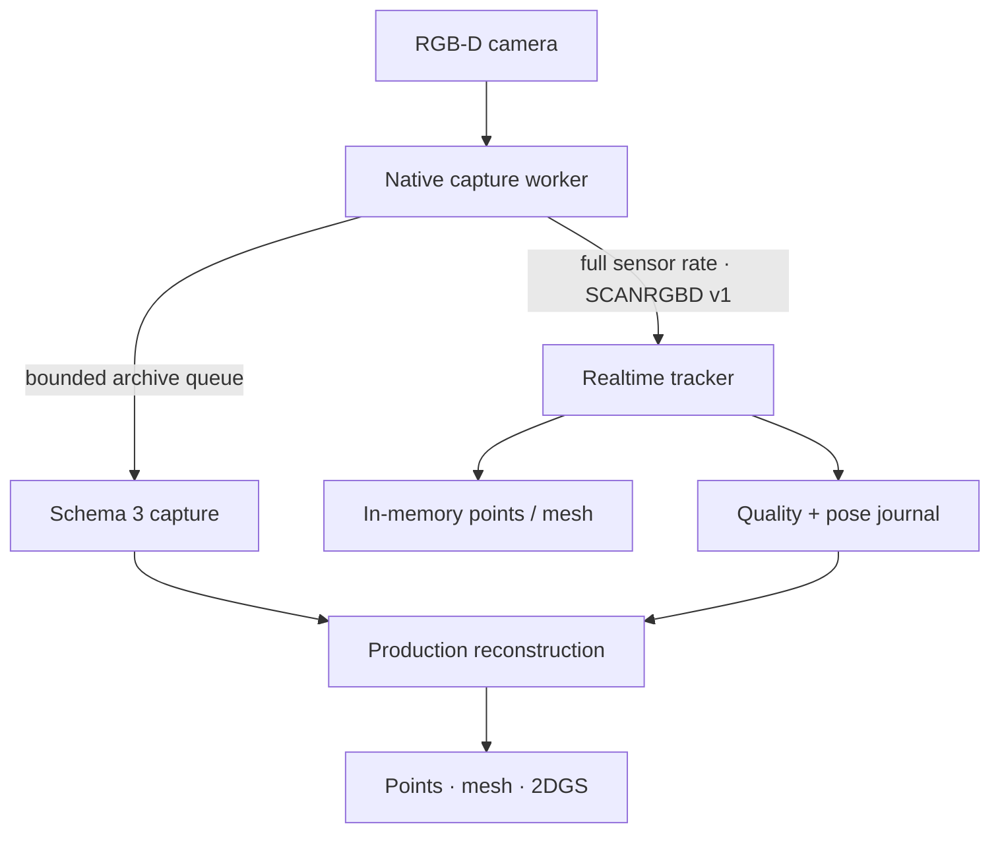

# ScanLan

ScanLan is a Windows-first, realtime RGB-D reconstruction application for Kinect v2, Azure Kinect DK, and Orbbec Femto Mega. A capture can become three production outputs from one calibrated trajectory:

- a metric colored point cloud (`PLY`);
- a textured triangle mesh (`OBJ` + `MTL` + `PNG`);
- a metric depth-aware 2D Gaussian surface (`3DGS-compatible PLY`).

The application intentionally supports one workflow only: **Capture → Reconstruct → Inspect & export**. There is no image/video import path, alternate preview camera, browser capture mode, project migration layer, or compatibility pipeline. Project and capture manifests must use schema 3.

## Design



The sensor thread never waits for disk, JPEG compression, the UI, or TSDF extraction. Its stream and archive writers are bounded and latest-wins. If downstream work falls behind, stale frames are dropped, sequence gaps are counted, and latency stays bounded.

Realtime processing uses three independent stages:

1. decode and edge-aware depth-speckle rejection;
2. persistent RGB-D odometry with an optional calibrated gyro prior, physical motion limits, metric overlap/RMSE gates, and recent-anchor relocalization;
3. weighted TSDF integration with asynchronous point extraction and an optional 1 Hz mesh.

The compact `tracking.jsonl` journal feeds accepted live poses into the production pass. Explicit tracking rejections are excluded from reconstruction. The final pass then refines short trajectory fragments, verifies nonlocal loop candidates, globally optimizes a pose graph, registers separate takes, and rebuilds the selected outputs from archived calibrated RGB-D data.

See [architecture](docs/architecture.md), [archive format](docs/scan-format.md), and [reconstruction details](docs/reconstruction.md).

## Camera support

| Camera | Connection | Tracking pose/input | Notes |
|---|---|---|---|
| Kinect v2 | USB 3 | Kinect Fusion pose, validated again by ScanLan | Kinect for Windows SDK 2.0 |
| Azure Kinect DK | USB 3 | RGB-D odometry + calibrated gyro prior | Azure Kinect Sensor SDK 1.4.x |
| Orbbec Femto Mega | USB or Ethernet | RGB-D odometry + calibrated gyro prior | Orbbec SDK v2; network default port 8090 |

Azure Kinect and Femto Mega expose these depth profiles:

| FOV | Sampling | Depth size | Sensor rate |
|---|---|---:|---:|
| Narrow | Full | 640×576 | 30 fps |
| Narrow | 2×2 binned | 320×288 | 30 fps |
| Wide | Full | 1024×1024 | 15 fps |
| Wide | 2×2 binned | 512×512 | 30 fps |

Azure Kinect pairs 30 fps depth with its highest compatible 2048×1536 RGB mode. The 15 fps wide/full profile records 3840×2160 RGB. This avoids the unsupported 30 fps + 4K configuration while preserving maximum texture detail at each sensor rate.

The archive rate is independent of the sensor/tracking rate. For example, a 10 fps archive still tracks a 30 fps camera stream.

## Windows setup

Install:

- Visual Studio 2022 with **Desktop development with C++** and CMake;
- Rust stable with the MSVC target;
- Node.js 20 or newer;
- Python 3.10–3.12 for the reconstruction worker;
- the SDK for at least one supported camera.

Then:

```powershell
npm install
npm run prepare:runtime
npm run debug
```

`prepare:runtime` builds both native capture executables. A camera SDK that is not installed produces a small unavailable-backend stub; it does not prevent other cameras from building. The command also packages the Open3D reconstruction worker.

For an optimized local build:

```powershell
npm run release
```

For the regular NSIS installer:

```powershell
npm run tauri -- build
```

## RTX 5080 / 12 GB setup

The stock Windows Open3D wheel is CPU-only. For Blackwell CUDA tracking and fusion, install CUDA Toolkit 12.8+ (CUDA 13.x is recommended), then build the project-local Open3D 0.19 wheel:

```powershell
npm run prepare:runtime
npm run prepare:cuda
```

The build targets compute capability 12.0 and repackages `scanlan-worker.exe`. Set `SCANLAN_DEVICE=cpu` before launching to diagnose the CPU path.

Depth-aware 2D Gaussian reconstruction is an isolated CUDA runtime. It requires Python 3.11 and builds gsplat for the installed GPU:

```powershell
npm run prepare:splat
npm run package:splat
```

The result is `build/ScanLan-splat-portable.zip`. The 12 GB profile selects up to 600 pose-coverage-balanced views, builds their canonical pinhole RGB-D data directly at 720 px, keeps a four-frame pinned-host LRU, groups shuffled training views into cache-local blocks, transfers compact integer RGB-D buffers for only the active view, and hard-bounds adaptive growth at two million Gaussians. It does not preload an entire scan into VRAM or repeatedly decode native 2K/4K frames.

Recommended starting profile on the specified laptop:

- narrow/full depth at 30 fps for normal indoor scans;
- 10–15 fps archive rate;
- 8–12 mm fusion voxels for rooms, 5–8 mm for smaller objects;
- live points while maximizing tracking headroom, or the 1 Hz live mesh when desired;
- 30,000 2DGS iterations, increasing only after the trajectory and mesh are clean.

## Capture practice

- Move steadily and retain roughly 40–70% of the previous view.
- When tracking searches, return to the last well-textured surface instead of continuing into unknown space.
- Revisit the start before stopping; this gives the production pass a strong loop-closure opportunity.
- Use corners, furniture, rocks, or temporary texture/marker boards around blank walls.
- Keep reflective glass and direct sunlight out of the depth camera when possible.
- Start a new take while viewing geometry already captured in the previous take.

## Deterministic replay

The reconstruction worker exposes the same versioned RGB-D protocol used by physical cameras:

```powershell
scanlan-worker.exe replay C:\Scans\Room\phases\<phase-id>
scanlan-worker.exe realtime --session C:\Temp\scanlan-replay --mode mesh --voxel-size 0.01
```

`replay` emits archived raw RGB-D frames, including frames rejected by the original live run, so tracker changes can be evaluated from identical input. Unit tests cover binary framing, truncation, queue overload, pose round-trips, quality gates, relocalization, and engine geometry messages.

## Verification

```powershell
npm run check
npm run build
cargo test --manifest-path src-tauri/Cargo.toml
.\build\worker-venv\Scripts\python.exe -m unittest discover -s worker\tests -v
.\splat-worker\.venv\Scripts\python.exe -m unittest discover -s splat-worker\tests -v
```

Native capture workers must also be compiled on Windows against their vendor SDKs; portable header tests cannot validate those SDK calls.

## Repository layout

- `src/` — focused Svelte UI and GPU viewer
- `src-tauri/` — project state, process supervision, artifact jobs, and exports
- `native/common/` — versioned stream, bounded archive, JPEG, and gyro utilities
- `native/kinect-capture/` — Kinect v2 + Kinect Fusion capture
- `native/modern-capture/` — Azure Kinect and Femto Mega capture
- `worker/` — realtime and final Open3D/NumPy reconstruction
- `splat-worker/` — isolated CUDA 2DGS trainer
- `scripts/` — Windows build and packaging entry points

Licensed under [GPL-3.0-only](LICENSE).
