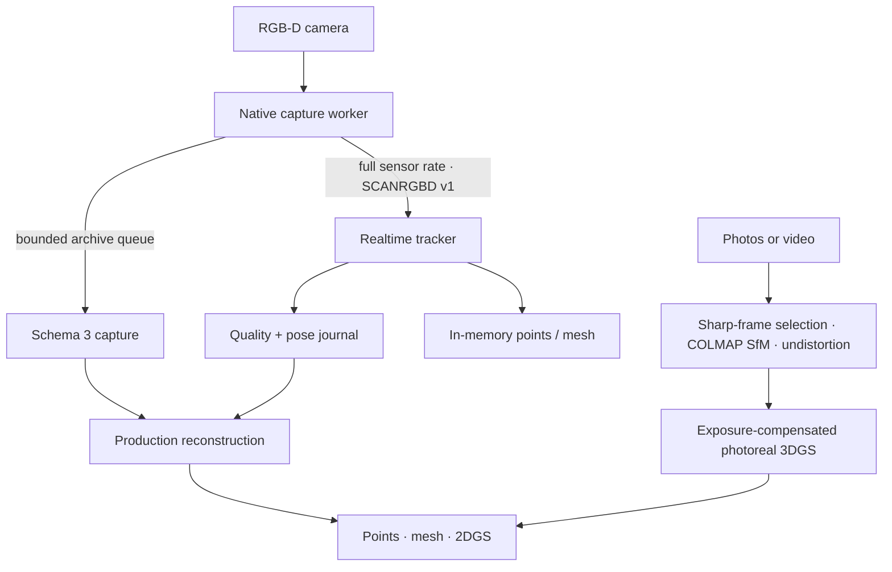

# ScanLan

ScanLan is a Windows-first, realtime RGB-D reconstruction application for Kinect v2, Azure Kinect DK, and Orbbec Femto Mega. A capture can become three production outputs from one calibrated trajectory:

- a metric colored point cloud (`PLY`);
- a textured triangle mesh (`OBJ` + `MTL` + `PNG`);
- a metric depth-aware 2D Gaussian surface (`3DGS-compatible PLY`).
- a photoreal anisotropic 3D Gaussian splat reconstructed from ordinary photos or video (`PLY` + compact live preview).

The application supports two quality-gated source paths: **Capture RGB-D → Reconstruct** and **Import photos/video → Solve cameras → Reconstruct**. Both finish in the same inspect/export workspace and publish interoperable 3DGS PLY files. Project and capture manifests use schema 3.

## Design



The sensor thread never waits for disk, JPEG compression, the UI, or TSDF extraction. Its stream and archive writers are bounded and latest-wins. If downstream work falls behind, stale frames are dropped, sequence gaps are counted, and latency stays bounded.

In the Capture workspace, a connected Azure Kinect or Femto Mega starts this pipeline in non-recording preview mode. The camera connection and realtime engine remain warm, so **Start capture** only opens the archive gate; preview RGB-D and IMU samples are never written into the take. Preview does not run odometry or retain tracking anchors: a fresh tracker takes the first usable recorded depth frame as its identity pose immediately after the archive gate opens. The viewport deliberately uses separate streams: idle Capture shows the current calibrated camera point cloud, recording switches to the accumulated quality-gated TSDF reconstruction, and stopping a take resumes the camera view. The final fused live point cloud is preserved with the take and is shown in Reconstruct even before production artifacts are built. Geometry polling is independent from status polling, so viewport responsiveness does not change capture resolution, archived pixels, voxel size, odometry thresholds, or drift gates. Preview stops before production reconstruction so it does not compete for the camera or CUDA device.

Realtime processing uses three independent stages:

1. decode and edge-aware depth-speckle rejection;
2. persistent RGB-D odometry with an optional calibrated gyro prior, deliberate handheld-motion limits, metric overlap/RMSE gates, and fail-closed recovery that must remain within 15 cm / 10 degrees of the last trusted pose and agree for three consecutive frames before integration;
3. weighted TSDF integration with asynchronous point extraction and an optional 1 Hz mesh.

The compact `tracking.jsonl` journal feeds accepted live poses into the production pass. A rejected live pose does not discard its archived pixels: the final pass keeps consecutive RGB-D frames for fresh offline odometry, then refines short trajectory fragments, verifies nonlocal loop candidates, globally optimizes a pose graph, registers separate takes, and rebuilds the selected outputs from archived calibrated RGB-D data.

See [architecture](docs/architecture.md), [archive format](docs/scan-format.md), and [reconstruction details](docs/reconstruction.md).

## Camera support

| Camera | Connection | Tracking pose/input | Notes |
|---|---|---|---|
| Kinect v2 | USB 3 | Kinect Fusion pose, validated again by ScanLan | Kinect for Windows SDK 2.0 |
| Azure Kinect DK | USB 3 | RGB-D odometry + calibrated gyro prior | Azure Kinect Sensor SDK 1.4.x |
| Orbbec Femto Mega | USB or Ethernet | RGB-D odometry + calibrated gyro prior | Orbbec SDK v2; network default port 8090 |

Azure Kinect and Femto Mega expose these depth profiles:

| FOV | Sampling | Depth size | Sensor rate |
|---|---|---:|---:|
| Narrow | Full | 640×576 | 30 fps |
| Narrow | 2×2 binned | 320×288 | 30 fps |
| Wide | Full | 1024×1024 | 15 fps |
| Wide | 2×2 binned | 512×512 | 30 fps |

Azure Kinect pairs 30 fps depth with its highest compatible 2048×1536 RGB mode. The 15 fps wide/full profile records 3840×2160 RGB. This avoids the unsupported 30 fps + 4K configuration while preserving maximum texture detail at each sensor rate.

The archive rate is independent of the sensor/tracking rate. For example, a 10 fps archive still tracks a 30 fps camera stream.

The Capture workspace exposes the modern cameras' sensor-side RGB controls: compatible stream resolution, automatic or locked exposure/gain, automatic or locked white balance, brightness, contrast, saturation, sharpness, backlight compensation where supported, and 50/60 Hz anti-flicker. Native-RGB archive size and JPEG quality are separate controls; for maximum texture detail use native size and quality 95-100. Kinect v2 remains fixed at 1920x1080 color because Kinect for Windows SDK 2.0 exposes its color-camera settings as read-only values.

Femto Mega also exposes exact accelerometer and gyroscope rate/range profiles. A faster rate improves temporal sampling but costs bandwidth and CPU. A narrower full-scale range provides finer quantization; a wider range such as +/-8 g prevents clipping but does not increase precision. Azure Kinect's SDK provides a factory-calibrated IMU stream without configurable rate or range, and Kinect v2 has no accessible IMU.

## Windows setup

Install:

- Visual Studio 2022 with **Desktop development with C++** and CMake;
- Rust stable with the MSVC target;
- Node.js 20 or newer;
- Python 3.10–3.12 for the reconstruction worker;
- the SDK for at least one supported camera.

Then:

```powershell
npm install
npm run prepare:runtime
npm run debug
```

`prepare:runtime` builds both native capture executables. A camera SDK that is not installed produces a small unavailable-backend stub; it does not prevent other cameras from building. The command also packages the Open3D reconstruction worker.

For an optimized local build:

```powershell
npm run release
```

For the regular NSIS installer:

```powershell
npm run tauri -- build
```

## RTX 5080 / 12 GB setup

The stock Windows Open3D wheel is CPU-only. For Blackwell CUDA tracking and fusion, install CUDA Toolkit 12.8+ (CUDA 13.x is recommended), then build the project-local Open3D 0.19 wheel:

```powershell
npm run prepare:runtime
npm run prepare:cuda
```

The build targets compute capability 12.0 and repackages the extracted worker at `worker\dist\scanlan-worker\scanlan-worker.exe`. Keeping its Open3D/CUDA runtime extracted avoids unpacking almost 1 GB every time preview or reconstruction starts. Set `SCANLAN_DEVICE=cpu` before launching to diagnose the CPU path.

Gaussian reconstruction is an isolated CUDA runtime. It requires Python 3.11 and packages gsplat, PyCOLMAP, and PyAV for RGB-D, photo, and video projects:

```powershell
npm run prepare:splat
npm run package:splat
```

The result is `build/ScanLan-splat-portable.zip`. RGB-D projects use metric tangent-aligned 2D discs; ordinary media projects use anisotropic 3D Gaussians initialized from the quality-filtered COLMAP point cloud. Both keep a four-frame pinned-host LRU, transfer only the active view to CUDA, bound adaptive growth by detected VRAM, publish atomic checkpoints, and stream a compact preview during training.

Recommended starting profile on the specified laptop:

- narrow/full depth at 30 fps for normal indoor scans;
- 10–15 fps archive rate;
- 8–12 mm fusion voxels for rooms, 5–8 mm for smaller objects;
- live points while maximizing tracking headroom, or the 1 Hz live mesh when desired;
- 30,000 Gaussian iterations for a normal production build; 45,000-60,000 can improve a well-covered high-detail photo/video capture.

## Photos and video

Choose **Import photos or video for Gaussian splatting…** in Capture. Imported sources are copied into the project so the job is durable. The production pass then:

1. orientation-normalizes photos and selects the sharpest non-duplicate video frame in each time bucket;
2. extracts dense SIFT features, performs guided geometric matching, reconstructs all consistent camera models, and selects the largest model;
3. rejects a solve that registers fewer than half the input views or produces too little reliable structure;
4. bundle-adjusts and undistorts registered source-resolution images to canonical pinhole cameras;
5. initializes 3D Gaussians from reliable COLMAP tracks and trains L1+SSIM appearance with degree-three spherical harmonics, bounded camera refinement, and per-view RGB exposure compensation.

The dataset manifest records registration ratio, excluded views, model count, reprojection error, track length, and warnings. Disconnected views are reported rather than forced into the splat. Video defaults to 2 sharp keyframes per second and a 600-frame ceiling.

For strong results, keep 60-80% overlap, translate as well as rotate the camera, lock focus/exposure when possible, avoid motion blur, and revisit the start of the path. A sparse panorama captured from one fixed point does not contain enough parallax for a full scene reconstruction.

The standalone preparation path is:

```powershell
scanlan-splat.exe prepare-media --project C:\path\to\project --source C:\photos\view-01.jpg --source C:\capture.mp4
scanlan-splat.exe train --project C:\path\to\project --dataset C:\path\to\project\outputs\cache\datasets\current.json --iterations 30000
```

## Capture practice

- Move steadily and retain roughly 40–70% of the previous view.
- When tracking searches, return to the last well-textured surface instead of continuing into unknown space.
- Revisit the start before stopping; this gives the production pass a strong loop-closure opportunity.
- Use corners, furniture, rocks, or temporary texture/marker boards around blank walls.
- Keep reflective glass and direct sunlight out of the depth camera when possible.
- Start a new take while viewing geometry already captured in the previous take.

For additional texture detail, build the mesh once, then use **Add and localize photos…** in Reconstruct. Use overlapping, sharp scene photos with fixed focus and white balance where possible. Accepted photos are metric PnP-localized from depth-backed RGB-D features and join the next mesh rebuild; ambiguous poses are reported and excluded. The worker command is `scanlan-worker localize-photos <project> <photo> [<photo> ...]`.

## Deterministic replay

The reconstruction worker exposes the same versioned RGB-D protocol used by physical cameras:

```powershell
worker\dist\scanlan-worker\scanlan-worker.exe replay C:\Scans\Room\phases\<phase-id>
worker\dist\scanlan-worker\scanlan-worker.exe realtime --session C:\Temp\scanlan-replay --mode mesh --voxel-size 0.01
```

`replay` emits archived raw RGB-D frames, including frames rejected by the original live run, so tracker changes can be evaluated from identical input. Unit tests cover binary framing, truncation, queue overload, pose round-trips, quality gates, relocalization, and engine geometry messages.

## Verification

```powershell
npm run check
npm run build
cargo test --manifest-path src-tauri/Cargo.toml
.\build\worker-venv\Scripts\python.exe -m unittest discover -s worker\tests -v
.\splat-worker\.venv\Scripts\python.exe -m unittest discover -s splat-worker\tests -v
```

Native capture workers must also be compiled on Windows against their vendor SDKs; portable header tests cannot validate those SDK calls.

## Repository layout

- `src/` — focused Svelte UI and GPU viewer
- `src-tauri/` — project state, process supervision, artifact jobs, and exports
- `native/common/` — versioned stream, bounded archive, JPEG, and gyro utilities
- `native/kinect-capture/` — Kinect v2 + Kinect Fusion capture
- `native/modern-capture/` — Azure Kinect and Femto Mega capture
- `worker/` — realtime and final Open3D/NumPy reconstruction
- `splat-worker/` — isolated COLMAP/PyAV media solver and CUDA 2DGS/3DGS trainer
- `scripts/` — Windows build and packaging entry points

Licensed under [GPL-3.0-only](LICENSE).
